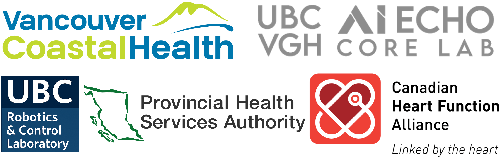
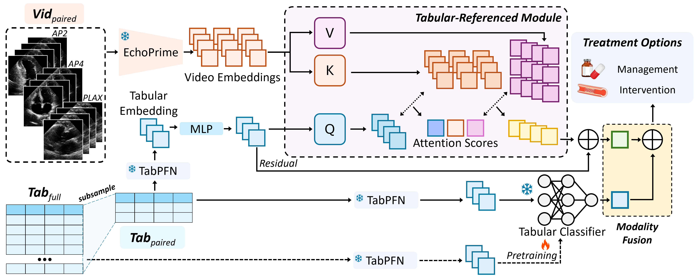

<p align="center">
  
</p>

# TREAT‑Net: Tabular‑Referenced Echo Analysis for Treatment Prediction in ACS

TREAT‑Net is a multimodal deep learning framework that integrates **echocardiography video embeddings** with **clinical tabular data** to predict treatment strategies for **acute coronary syndrome (ACS)** patients. The model supports both **cross‑attention fusion** and **late fusion**, capturing complementary information to improve robustness and interpretability.

<p align="center">
  
</p>

---

## Features

* **Multimodal training**: video embeddings + clinical features.
* **Fusion strategies**: `video`, `video+tab` (joint), and `late_fusion`.
* **Configurable Transformer** backbones (layers, heads, hidden sizes).
* **Reproducible evaluation** with deterministic seeds and saved CSV outputs.
* **Lightweight logging** (optional Weights & Biases; disable with `-nw`).

---

## Installation

```bash
# Python ≥ 3.9 recommended
python -m venv .venv
source .venv/bin/activate  # (Windows: .venv\Scripts\activate)

# Install deps
pip install -r requirements.txt
# or minimal stack if you prefer pinning manually
pip install torch torchvision torchaudio scikit-learn pandas numpy tqdm wandb matplotlib
```

> **Note**: If you don’t use Weights & Biases, add `-nw` or `--no_wandb` to disable logging.

---

## Data & Inputs

TREAT‑Net trains on **EchoPrime video embeddings** plus **clinical tabular features**.

You can supply data in two ways:

### A) Precomputed video embeddings (recommended)

Place the following files under `EMB_DIR` (see the constant/path in `model/src/dataloader.py`):

* `echoprime_train_grouped_by_mrn.pt`
* `echoprime_val_grouped_by_mrn.pt`
* `echoprime_test_grouped_by_mrn.pt`

Update `EMB_DIR` in `model/src/dataloader.py` to point to your local path.

### B) Raw‑study CSV (cine/study mode)

Your CSV should include at least the following columns:

* `mrn_1` — patient identifier (de‑identified or study key)
* `processed_file_address` — path to the clip or embedding file
* `view` — e.g., `AP2`, `AP4`, `PLAX`
* `MANAG` — treatment label in `{MANAG, INTERVENTION}`

See `model/src/dataloader.py:get_all_files_and_ground_truths` for the exact parsing expected by the loaders.

---

## Quick Start

Run from the repository root:

```bash
# Multimodal (video + tabular) with late fusion, ACS treatment prediction (tp)
python main.py \
  --exp_dir runs/exp_tp_late \
  --target tp \
  --mode late_fusion \
  --epochs 150 \
  --batch_size 8 \
  --eval_batch_size 32 \
  --lr 1e-3 \
  --num_layers 2 \
  --nhead 4 \
  -nw  # disable wandb (optional)
```

Other common modes:

```bash
# Video‑only
python main.py --target tp --mode video -nw --exp_dir runs/exp_video

# Joint fusion (cross‑attention + tabular)
python main.py --target tp --mode video+tab -nw --exp_dir runs/exp_vtab
```

---

## Key Arguments (subset)

* `--target {cad,tp}`: prediction task (default `cad`; we primarily use `tp`).
* `--mode {video,video+tab,late_fusion}`: fusion strategy.
* Optimization: `--epochs`, `--batch_size`, `--eval_batch_size`, `--lr`, `--weight_decay`.
* Architecture: `--num_layers`, `--nhead` (Transformer backbone size).
* Freezing: `--freeze` (freeze backbone), `--unfreeze_encoder` (undo freeze).
* I/O: `--save_embeddings` (dump learned embeddings), `--tab_weight /path/to/tab_model.pt` (load pretrained tabular encoder).
* Misc: `--seed`, `--no_wandb` (`-nw`), `--debug`.

---

## Outputs

* **Checkpoints**, **metrics**, and **logs** are written under `--exp_dir`.
* Per‑split predictions are saved as CSVs:

  * `{exp_dir}/{split}_preds.csv`
  * `{exp_dir}/{split}_probs.csv`

---

## Example Repository Layout

```
TREAT-Net/
├─ main.py
├─ model/
│  └─ src/
│     ├─ dataloader.py
│     ├─ models/
│     └─ utils.py
├─ scripts/
│  └─ run.sh
├─ runs/                 # experiment outputs (user-defined)
```

---

## Acknowledgements

We thank our collaborators and clinical partners for their invaluable support and feedback. This work was developed as part of our MICCAI 2025 workshop paper, *TREAT‑Net: Tabular‑Referenced Echo Analysis for Treatment Prediction in ACS patients*.

---

## Citation

If you find this work useful, please cite our paper (update authors/venue/year as appropriate):

```bibtex
@inproceedings{kim2025treat,
  title={TREAT-Net: Tabular-Referenced Echocardiography Analysis for Acute Coronary Syndrome Treatment Prediction},
  author={Kim, Diane and To, Minh Nguyen Nhat and Abdalla, Sherif and Tsang, Teresa SM and Abolmaesumi, Purang and Luong, Christina},
  booktitle={International Workshop on Advances in Simplifying Medical Ultrasound},
  pages={238--247},
  year={2025},
  organization={Springer}
}
```

---

## License

Specify your license here (e.g., MIT, Apache‑2.0). If unsure, add a `LICENSE` file and update this section accordingly.

---

## Contact

For questions or collaboration, please open an issue or contact the maintainers.
